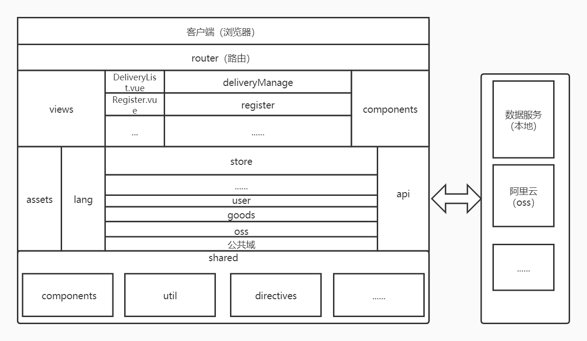
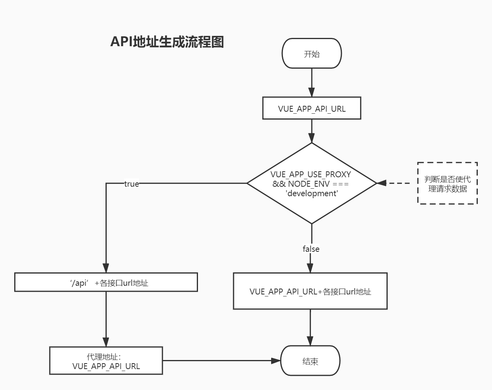

# srm-web

## 框架功能

支持 vue 使用  
支持 vue-router 使用  
支持 vuex 使用  
支持 jsx 语法  
支持 ElementUI 库使用  
支持 echarts 图表

## IDE

编辑器: Visual Studio Code  
插件安装：  
Auto Close Tag  
Debugger for Chrome  
ESLint  
Vetur  
Prettier - Code formatter  
Path Intellisense (路径提示)

## 技术栈

node:12.14.0(nvm 管理,自带 npm 6.13.4)  
基础：vue+vue-router+vuex+scss+jsx  
国际化：vue-i18n  
UI 组件库：element-ui  
图表库：echarts + vue-echarts  
工具库：lodash、qs(序列化)、bignumber.js(大数据计算)、crypto-js(加密)、jsbarcode(条形码)、js-cookie
http 请求库：axios  
流程可视化库：jsplumb  
语法转译： babel  
语法规则和代码风格检测： eslint  
单元测试： unit-mocha  
端到端测试： e2e-cypress  
构建工具：vue-cli 4.1.2 (内置 webpack)

## 目录/文件

```
├── public                   // 存放不希望被webpack处理的文件
├── src                      // 源码
    ├── api                  // 存放API请求
    ├── assets               // 存放静态文件
    ├── lang                 // 国际化
    ├── router               // 路由
    ├── shared               // 存放共享代码,包括util、http、api、vue指令、过滤器、混入、插件等
        ├── components       // 存放公共组件
        ├── directives       // 存放公共directives
        ├── filters          // 存放公共filters
        ├── mixins           // 存放公共mixins
        ├── plugins          // 存放公共plugins
        ├── http.js          // http工具封装
        ├── util             // 工具相关封装
        ├── validate         // 校验相关,正则等
        ├── ws.js            // websoket封装
    ├── store                // 数据状态
    ├── views                // 视图:子文件是路由的入口文件，包括菜单页及登录、注册等单独页面的入口。各入口页面中的组件新建对应的业务目录存储
        ├── components       // 页面级公共组件
        ├── commonViews      // odm供应商和oem供应商用户的公用路由视图
        ├── oemViews         // oem供应商的路由视图
    ├── App.vue              // 根组件
    ├── main.js              // 系统入口
├── tests                    // 测试
    ├── unit                 // 单元测试文件存放目录
├── .browserslistrc          // 兼容目标浏览器配置
├── .editorconfig            // 编辑器统一配置文件
├── .env                     // 公共环境变量配置
├── .env.development         // 开发模式下环境变量配置 vue-cli-service serve
├── .env.production          // 生产模式下环境变量配置 vue-cli-service build、vue-cli-service test:e2e
├── .env.test                // 测试模式下环境变量配置 vue-cli-service test:unit
├── .eslintrc.js             // 全局eslint配置文件
├── babel.config.js          // babel配置
├── vue.config.js            // 项目配置文件
├── .gitignore               // git忽略提交规则配置
├── 规范.md                  // 规范文档
├── 版本记录.md              // 版本记录文档,目前在gitlab上维护了
```

## 部署

路由采用 history 模式服务器需要做的配置  
nginx

```

location / {
  try_files $uri $uri/ /index.html;//这一行配置
}

```

## 系统设计



## 流程图

api 地址生成流程图


